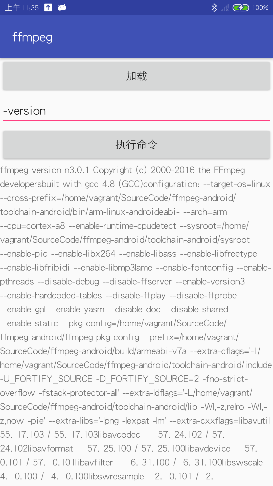

# FFmpeg_Android
基于ffmpeg库https://github.com/WritingMinds/ffmpeg-android-java

- 1、首先找一个mp4文件，将之命名为in.mp4
- 2、使用命令adb push in.mp4 /sdcard/in.mp4  将in.mp4文件push到手机sd卡上
- 3、执行界面上的命令
- 4、执行结束，可以使用命令 adb pull /sdcard/out.mp4 out.mp4 将手机上的out.mp4导出到电脑上
- 5、对比in.mp4与out.mp4的视频质量和大小

# scrren

